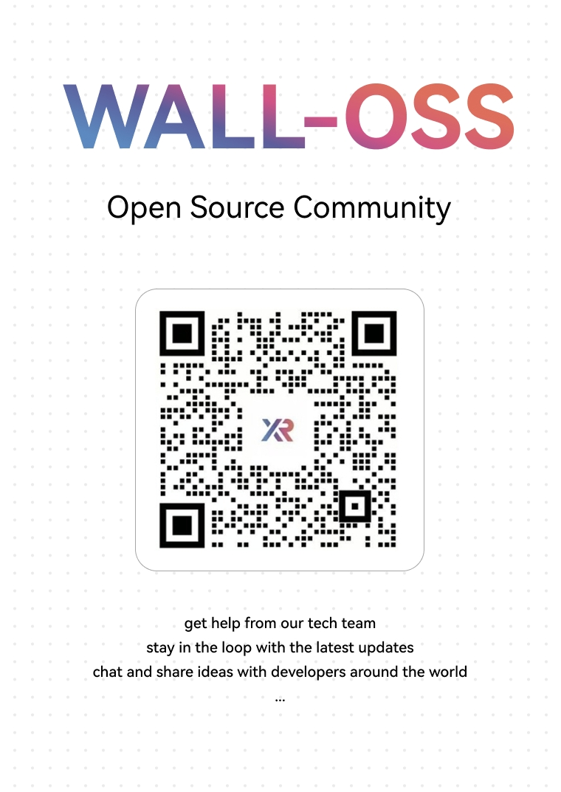

# WALL-OSS

<div align="left">

<p align="center">
    
<p>

<div align="center">

[](https://x2robot.cn-wlcb.ufileos.com/wall_oss.pdf)
&nbsp;&nbsp;
[](https://huggingface.co/x-square-robot)
&nbsp;&nbsp;
[](https://github.com/X-Square-Robot/wall-x)
&nbsp;&nbsp;
[](https://x2robot.com/en/research/68bc2cde8497d7f238dde690)

</div>

</div>

## <a href="https://x2robot.cn-wlcb.ufileos.com/wall_oss.pdf" target="_blank"><strong>WALL-OSS: Igniting VLMs toward the Embodied Space</strong></a>

We introduce **WALL-OSS**, an end-to-end embodied foundation model that leverages large-scale multimodal pretraining to achieve (1) embodiment-aware vision--language understanding, (2) strong language--action association, and (3) robust manipulation capability.
Our approach employs a tightly coupled architecture and multi-strategies training curriculum that enables Unified Cross-Level CoT—seamlessly unifying instruction reasoning, subgoal decomposition, and fine-grained action synthesis within a single differentiable framework.
Our results show that WALL-OSS attains high success on complex long-horizon manipulations, demonstrates strong instruction-following capabilities, complex   understanding and reasoning, and outperforms strong baselines, thereby providing a reliable and scalable path from VLMs to embodied foundation models.

## 🎬 Video Demos

<div align="center">
    <video width="80%" controls>
        <source src="https://x2robot.com/api/videos/file/wall-oss_top_720p-1.mp4" type="video/mp4">
        Your browser does not support the video tag.
    </video>
    <p><strong>WALL-OSS in Action: Demonstrating advanced manipulation capabilities and embodied AI performance</strong></p>
</div>


## 🚀 Quick Start

### Installation

```bash
# Create conda environment
conda create --name wallx python=3.10
conda activate wallx

# Install base requirements
pip install torch torchvision transformers
pip install huggingface_hub

# Install Wall-X from GitHub
git clone https://github.com/X-Square-Robot/wall-x.git
cd wall-x
pip install -e .
```

### Basic Usage

```python
import torch
from wall_x.model.qwen2_5_based.modeling_qwen2_5_vl_act import Qwen2_5_VLMoEForAction

# Load the model
model_path = "X-Square-Robot/wall-oss-flow"  # or your local path
model = Qwen2_5_VLMoEForAction.from_pretrained(model_path)
model.eval()

# Configuration
device = "cuda" if torch.cuda.is_available() else "cpu"
model = model.to(device).bfloat16()

# Your inference code here...
```

## 🎯 Supervised Fine-Tuning (SFT)

For training Wall-X on your robotics datasets, please refer to our comprehensive training guide:

**📖 [Training Documentation](https://github.com/X-Square-Robot/wall-x/blob/main/workspace/README.md)**

The training process includes:
- **Dataset Preparation**: How to prepare your robotics datasets in LeRobot format
- **Configuration Setup**: Detailed configuration for GPU setup, model paths, and robot DOF settings
- **Training Scripts**: Ready-to-use training scripts with proper hyperparameters

### Quick Training Start

```bash
# Run training (see workspace/README.md for detailed configuration)
bash ./workspace/lerobot_example/run.sh
```

## 🔮 Inference

For detailed inference examples and model evaluation:

**📖 [Inference Documentation](https://github.com/X-Square-Robot/wall-x/blob/main/scripts/)**

### Basic Inference Example

```python
import torch
from wall_x.model.qwen2_5_based.modeling_qwen2_5_vl_act import Qwen2_5_VLMoEForAction

# Load model
model_path = "X-Square-Robot/wall-x"
model = Qwen2_5_VLMoEForAction.from_pretrained(model_path)
model.eval()

# Setup
batch_size = 1
seq_length = 50
device = "cuda" if torch.cuda.is_available() else "cpu"
model = model.to(device).bfloat16()

# Prepare inputs (example with synthetic data)
torch.manual_seed(0)
input_ids = torch.randint(0, len(model.processor.tokenizer), (batch_size, seq_length), dtype=torch.long)
attention_mask = torch.ones((batch_size, seq_length), dtype=torch.long)
moe_token_types = torch.zeros((batch_size, seq_length), dtype=torch.long)
position_ids = torch.arange(seq_length, dtype=torch.long).unsqueeze(0).expand(batch_size, -1)

# Robotics-specific inputs
proprioception = torch.randn((batch_size, 1, 20), dtype=torch.float32)  # Joint states
agent_pos_mask = torch.ones((batch_size, 1, 20), dtype=torch.float32)
dof_mask = torch.ones((batch_size, 32, 20), dtype=torch.float32)  # DOF mask
dataset_names = ["x2_normal"]

# Move to device
inputs = {
    "input_ids": input_ids.to(device),
    "attention_mask": attention_mask.to(device),
    "moe_token_types": moe_token_types.to(device),
    "position_ids": position_ids.to(device),
    "proprioception": proprioception.to(device).bfloat16(),
    "agent_pos_mask": agent_pos_mask.to(device).bfloat16(),
    "dof_mask": dof_mask.to(device).bfloat16(),
    "dataset_names": dataset_names,
    "mode": "validate"
}

# Run inference
with torch.no_grad():
    outputs = model(**inputs)
    print(f"Output logits shape: {outputs.logits.shape}")
```

### Advanced Inference Scripts

For production-ready inference and evaluation scripts:

```bash
# Basic inference test
python ./scripts/fake_inference.py

# Generate open-loop comparison plots
python ./scripts/draw_openloop_plot.py
```

### VQA Inference and Chain-of-Thought Testing

To run VQA inference and test the model's Chain-of-Thought (COT) reasoning capabilities, please follow:

```bash
python ./scripts/vqa_inference.py
```

This script can be used to test the model's COT reasoning abilities for embodied tasks. Below is an example of COT testing:

**Input Image:**


**Input Text:**
```
To move the red block in the plate with same color, what should you do next? Think step by step.
```

**Model Output (COT Reasoning):**
```
To move the red block in the plate with the same color, you should first locate the red block. It is currently positioned on the table, not in the plate. Then, you should carefully grasp the red block using your fingers. Next, you should use your hand to lift the red block from the table and place it into the plate that is also red in color. Ensure that the red block is securely placed in the plate without slipping or falling.
```

## Join Our Community
- Scan the QR code on WeChat to join the discussion group, where you can engage in in-depth exchanges with community developers and the official team.


## 📚 Cite Us

If you find WALL-OSS models useful, please cite:

```bibtex
@misc{walloss_paper_2025,
  title        = {WALL-OSS: Igniting VLMs toward the Embodied Space},
  author       = {X Square Robot},
  year         = {2025},
  howpublished = {\url{https://x2robot.cn-wlcb.ufileos.com/wall_oss.pdf}},
  note         = {White paper}
}
```
